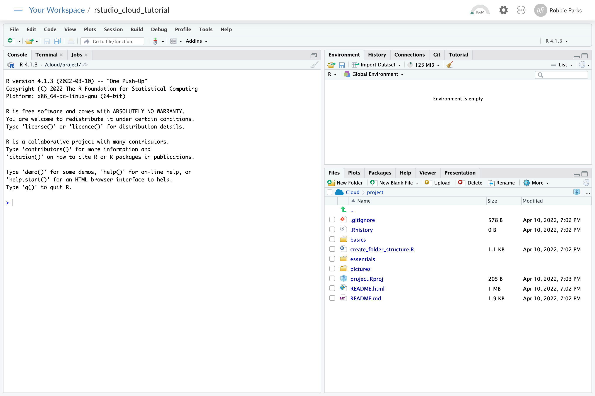
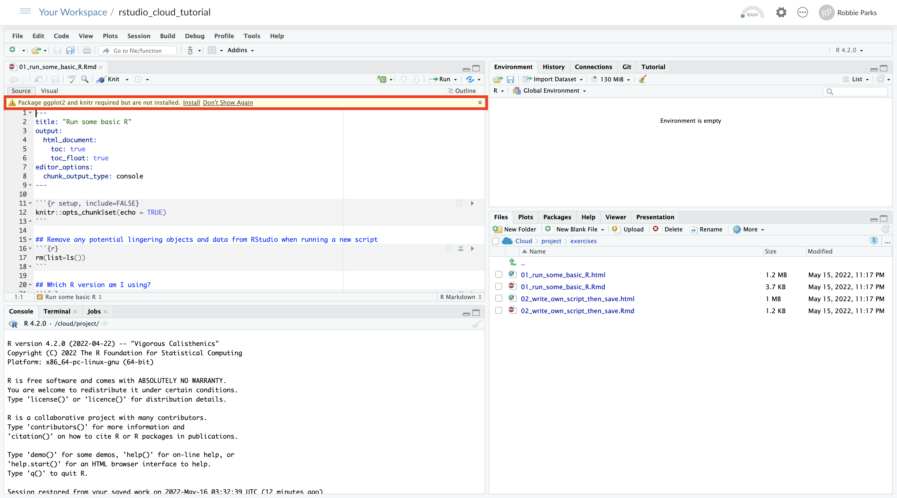
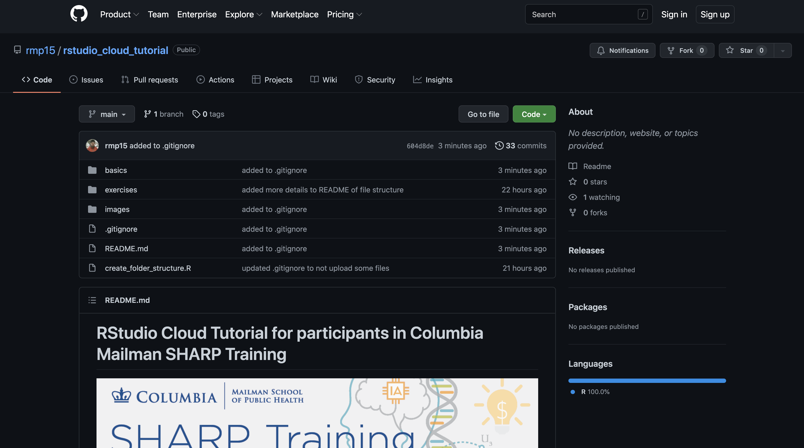

# 01: Absolute basics of R, RStudio, RStudio Cloud, R Packages, Git, and GitHub

## What is R?

R is an interactive environment developed by statisticians for data analysis.\
A more detailed Introduction to R can be found at https://www.r-project.org. \
Below is a sample screenshot of an R session on a local computer:

## What is RStudio?

RStudio is an integrated development environment (IDE) for R developed by J J Allaire.\
RStudio provides a convenient graphical interface to R, making it more user-friendly, and providing many useful features.\
Such features include direct code execution, tools for plotting, history, debugging and workspace management.\
A more detailed background on to RStudio can be found at https://www.rstudio.com/about/.

## What is RStudio Cloud?

RStudio Cloud is a cloud-based RStudio which runs projects and code in the cloud.\
RStudio Cloud allows convenient scaling and sharing of code, including for training programs such as SHARP. \
Registration for free is available via https://rstudio.cloud/ \
We will go through how to navigate RStudio Cloud in the basics folder. \
More details are available via https://rstudio.cloud/learn/guide.

## What is an R package?

An R package is an important and very common form of shareable code. A package is usually downloaded from the Comprehensive R Archive Network (CRAN), and is usually very easy to do in RStudio Cloud. Countless example exist, including very famous examples such as [ggplot](https://epirhandbook.com/en/ggplot-basics.html) and [tidyverse](https://tidyverse.tidyverse.org/). When you first use an RStudio Cloud with a cloned GitHub project and start doing something, you will often see something like the yellow bar at the top of the window highlighted below asking if you want to install a package. The answer is almost always yes. You can assume the answer will be yes throughout this tutorial.

## What is Git?

This is just for information, as you will not be expected to be an expert on Git to participate in your SHARP course.

Git is a widely used version control system. \
Version control, or source control, is the practice of tracking and managing changes to software code. \
Version control systems are software tools that help software teams manage changes to source code over time. \
In an academic context, it is useful to collaborate on a common project where you can all see the changes which are being made, and then there ends up being a master version once all suggested changes have been processed.\
For the SHARP workshops, Git will be used to clone a copy of the SHARP project to use throughout the training days.\

More details are available via https://www.codementor.io/git/tutorial/git-github-tutorial-for-beginners.

## What is GitHub?

This is just for information, as you will not be expected to be an expert on GitHub to participate in your SHARP course.

GitHub is a for-profit company which offers a cloud-based Git repository hosting service. \
For most people, Git and GitHub are interchangeable, but one is the version control system used (Git), and the other is the hosting service (GitHub).

More details are available via https://www.codementor.io/git/tutorial/git-github-tutorial-for-beginners.

## You should now be ready to learn how to sign up to RStudio Cloud!

Click link below for next tutorial

[02_signing_up.md](https://github.com/rmp15/rstudio_cloud_tutorial/blob/main/basics/02_signing_up.md)
