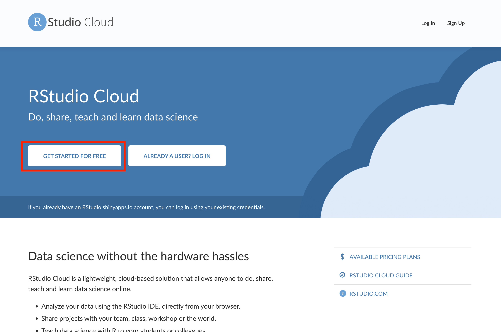
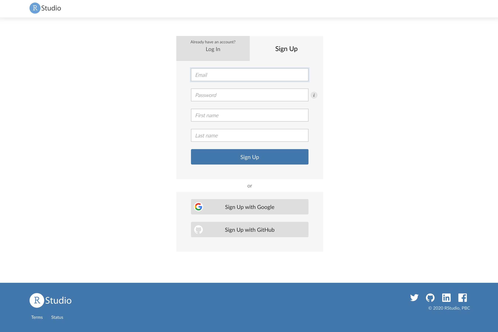

# Signing up to RStudio Cloud

## The first step is to create a free RStudio Cloud account by visiting https://rstudio.cloud/ and clicking on 'Get Started For Free' to sign up (as detailed in the step-by-step images below):

## Now click on the Sign Up button:

## Fill out your contact information and then click Sign Up to complete the sign-up process:

## You will then be prompted to verify your email address via your email account. Once this is done, you should be able to log in and see something like this:

You should now be ready to learn how to clone a GitHub repository into RStudio Cloud!

## Click link below for next tutorial

[03_clone_github_project.md](https://github.com/rmp15/rstudio_cloud_tutorial/blob/main/basics/03_clone_github_project.md)
