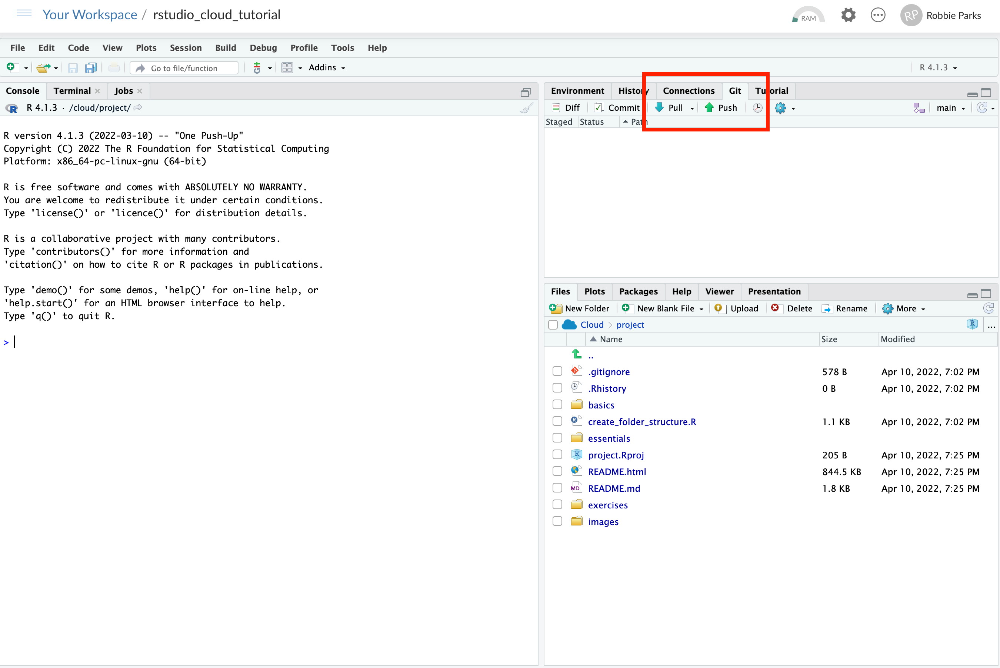
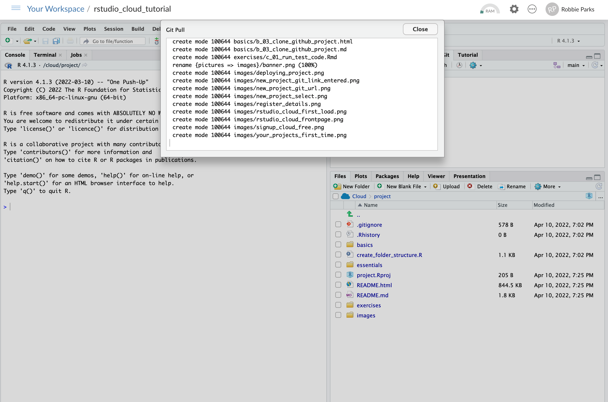

# Update GitHub project using Git pull

## SHARP training program instructors may make edits to the R projects after you’ve already saved the project to your RStudio or RStudio Cloud. As a result, they may ask you to 'pull' project updates during one of the sessions you attend. In this case, you should click 'git' in the top right window in the project view and then click on the 'pull' button, as highlighted below:

## All being well, you will be able to update the project, with a summary window showing what has been changed in the R Project:

## You can then continue with the training with the updated project!

## Click link below for next tutorial

[05_navigating_RStudio_cloud.md](https://github.com/rmp15/rstudio_cloud_tutorial/blob/main/basics/05_navigating_RStudio_cloud.md)
