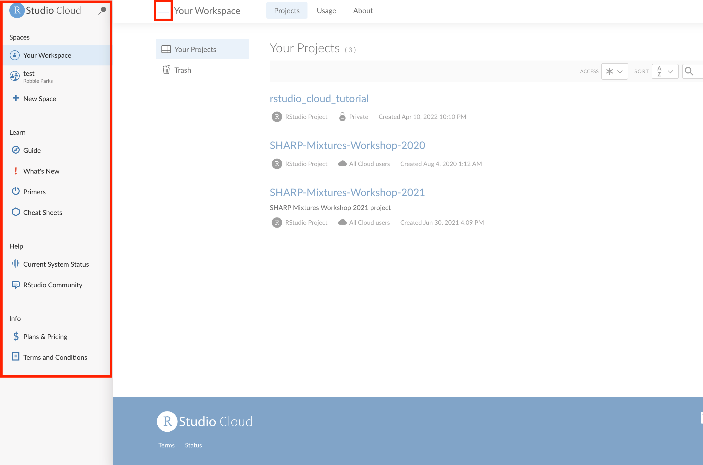
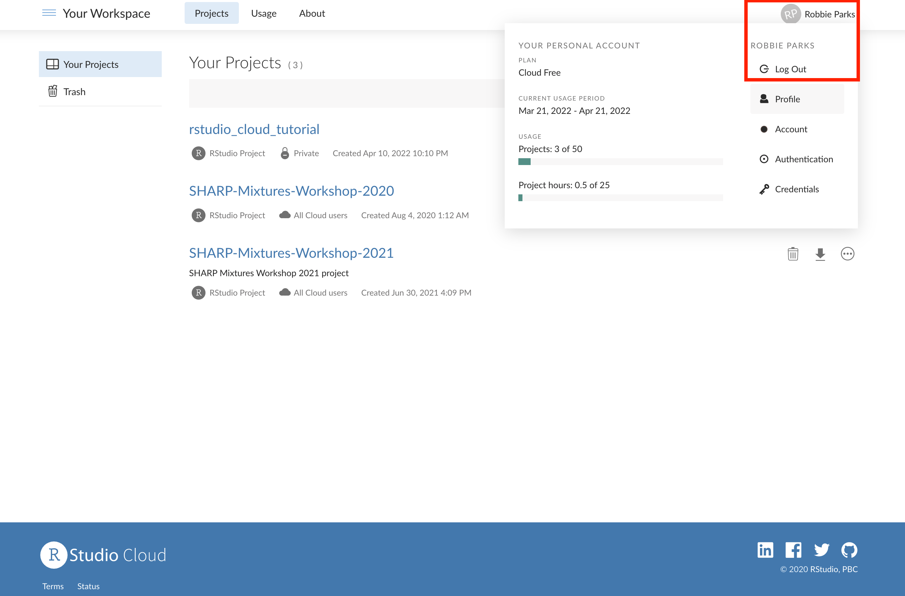

# Navigating RStudio Cloud menu

## Once you've logged in to your RStudio Cloud account after the very first time, you'll generally have a view of projects that you've copied over:

## You can click on the three horizontal lines in the top-left corner to open up a set of additional options, including creating additional Spaces (which may be useful for future reference but is outside the scope of this tutorial), and some useful general guides and primers: 

## If you want to log out of your account, click on your name in the top-right of the menu, then click on 'Log Out':

## Now you should be ready to learn how to save a permanent copy of the GitHub repository!

Click link below for next tutorial

[06_saving_permanent_copy.md](https://github.com/rmp15/rstudio_cloud_tutorial/blob/main/basics/06_saving_permanent_copy.md)
