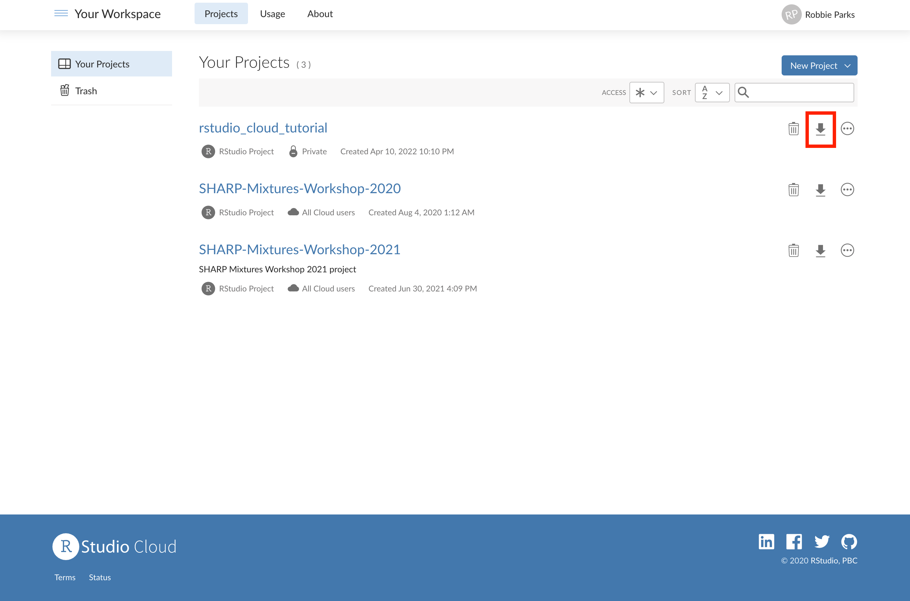

# 06: Saving a permanent local copy

## At the end of the workshop, you may want to retain all of the edits and notes you made to the R scripts to use for reference later on. This can be done via the main menu, where you will see the download button highlighted below:

## Once you click on that, you will get an export processing window:

## Once this is complete, you will be able to click on the 'Download' button to save a local copy of your edited project:

## We highly recommend saving everything at the end of the SHARP training, as you may have made several edits throughout the days.

## Note: You can also clone the GitHub repository directly from the GitHub project repository website (the one for this project is https://github.com/rmp15/rstudio_cloud_tutorial), but without your personal changes, which you can do by clicking on the blue Code button and clicking 'Download ZIP':

You can now proceed to the exercises folder which will need to be done in your RStudio Cloud...
