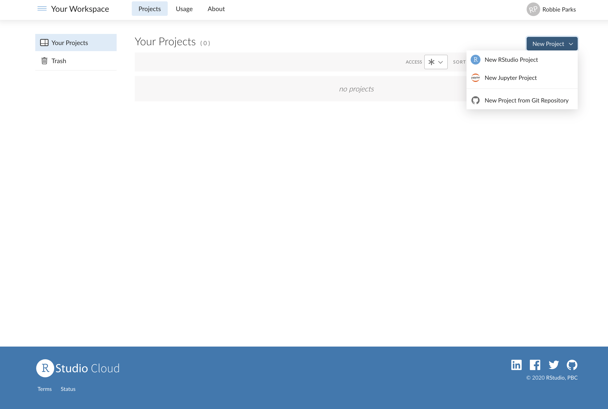
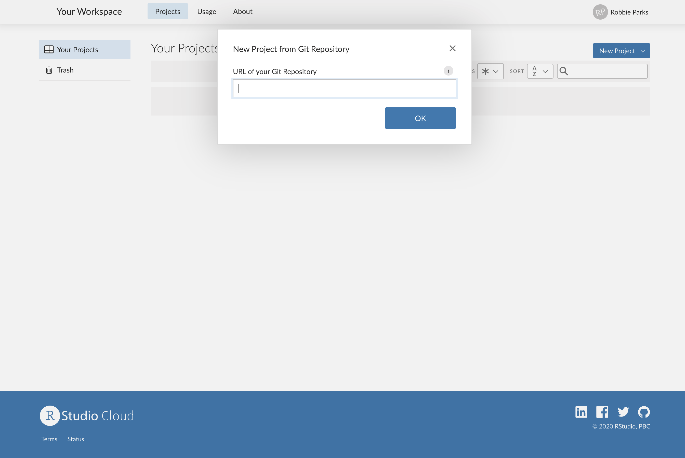
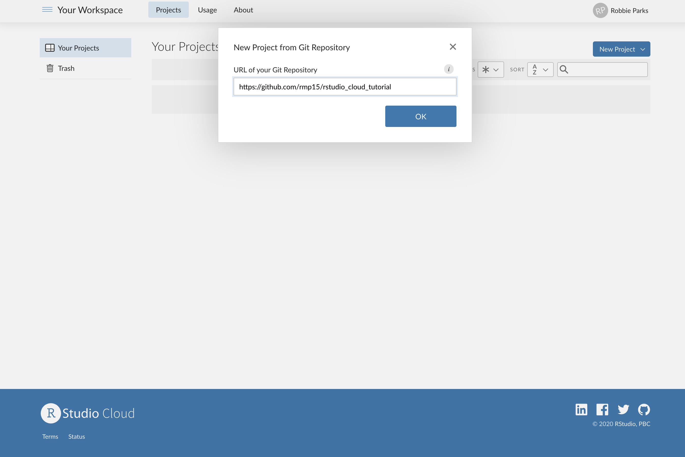
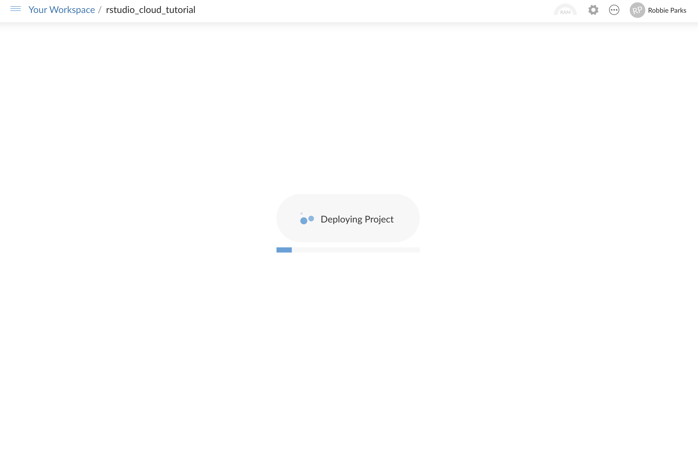

# Clone GitHub project to RStudio Cloud

## From signing up and logging in to Rstudio Cloud via https://rstudio.cloud/, you should see this page:

## Click on "New Project" and you should see several choices, including "New Project from Git Repository":

## Click on "New Project from Git Repository", you should see an invitation to enter a URL of your Git Repository:

## Enter https://github.com/rmp15/rstudio_cloud_tutorial into the box and click "OK":

## You should see the "Deploying Project" screen for a time while the project copies from GitHub:

## You should then see a screen which looks a lot like an RStudio set-up on your local computer, but in your web browser and with an extra bar starting with 'Your Workspace':

