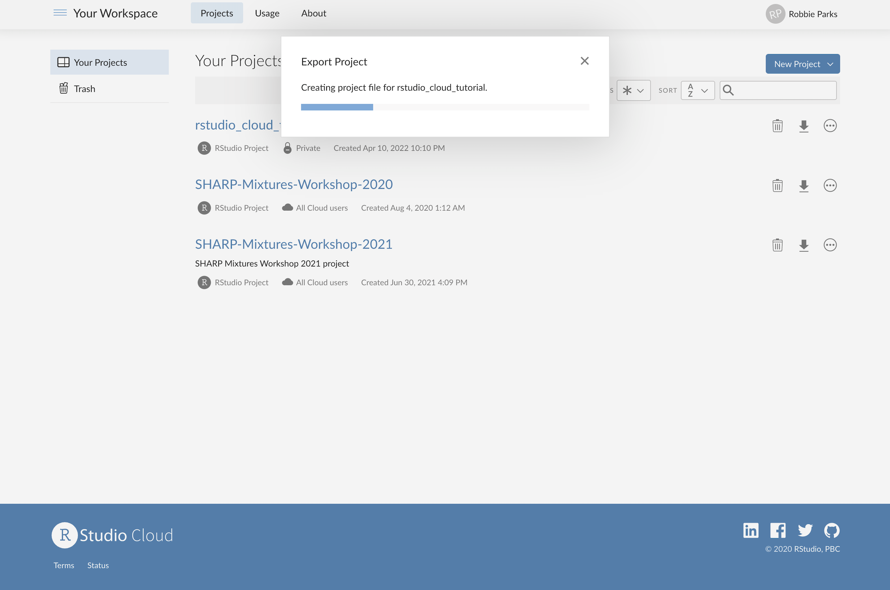
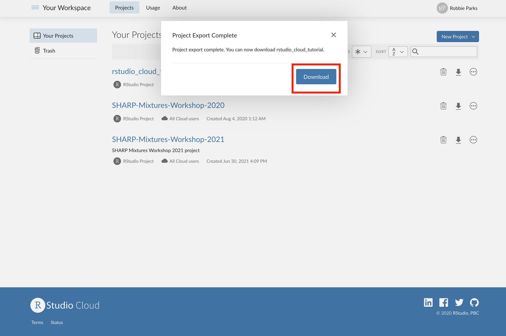

# Saving a permanent local copy

## Sometimes you will want to add some edits or even new scripts to the copied project in RStudio Cloud, and then take it away for reference and use after the SHARP training. This can be done via the main menu, where you will see the download button highlighted below: 

## Once you click on that, you will get an export processing window:

## Once this is complete, you will be able to click on the 'Download' button to save a local copy of your edited project:

## This is likely best done at the end of the SHARP training, as you may have made several edits throughout the days.
